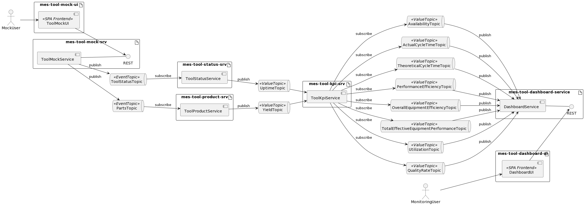

# mes-tool-kpi-srv
A microservice to consume yield and tool value topics to compute and repost tool key performance indicators. A tool here is ment to be a machine or other piece of equipment producting parts.


This service consumes the following tool-related and product-related topics:

1. ST   Scheduled Time
2. DT   Downtime
3. UT   Uptime
4. Y    Yield

where 
```
Y := {
  TAP := number   # Total Amount Produced
  AAP := number   # Actual Amount Produced
  RAP := number   # Rejected Amount Produced
  toolId: string
}
```

From these inputs. this service computes the follwing KPI and posts them on the associated topics

1. OEE  Overall Equipment Efficiency
2. TEEP Total Effective Equipment Performance
3. TCT  Theoretical Cycle Time (value taken from the minimum of values seen so far)

See [calculation schema](doc/calc.pdf).

This service interfaces with the **`mes-bus-srv`** and an **`mes-kpi-db`** database to maintain service-related state.

## Fit Into Overall Architecture


* 
* 
* 
* 
